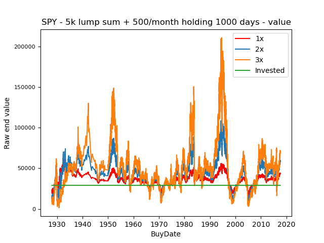

# Big backtest on daily resetting leverage on the S&P 500 index

### "Leveraged ETFs Are Not a Long-Term Bet" myth

[Daily resetting ETFs are often called a poor long term investment.](https://www.investopedia.com/articles/financial-advisors/082515/why-leveraged-etfs-are-not-longterm-bet.asp) This is mainly because of volatility decay, also called beta decay. The most common example I see is that whenever the underlying index drops 10% then gains 10% the next day, a leveraged portfolio would lose a lot more value compared to the underlying.

Underlying: 100 -> 90 -> 99 - 1% loss

3x Leverage: 100 -> 70 -> 91 - 9% loss

A 9% loss is not a 3x of 1% loss!

A plot showing what it means in practice:

What is often forgotten, is that the daily resetting also helps and serves as protection in some cases. Let's take an example where the underlying drops 10% four days in a row:

Underlying: 100 -> 90 -> 81 -> 73 -> 65 - 35% loss

3x Leverage: 100 -> 70 -> 49 -> 35 -> 24 - 76% loss

A 76% loss is a lot less than 3x of 35% loss. If it did not reset daily, the leveraged portfolio would be wiped out as 35*3 = 105% loss!

The same is also true when the underlying increases multiple days in a row:

Underlying: 100 -> 110 -> 121 -> 133 -> 146 - 46% gain

3x Leverage: 100 -> 130 -> 169 -> 220 -> 286 - 186% gain

A 186% gain is a lot better than the expected 46*3 = 138% gain.

## Backtests

### 5k lump sum + 500/month DCA:

###¤ Lots of data - mean, median, percentiles, probabilities etc:
250 trading days = 1 year

#### Plots 

| End value compared to SPY  |  Raw end values   |
:-------------------------:|:-------------------------:
|  |  |
|  |  |
|  |  |
|  |  |
|  |  |
|  |  |
|  |  |
|  |  |
|  |  |
|  |  |

### 10k lump sum no DCA:

#### LOTS OF NUMBERS - mean, median, percentiles, probabilities etc:

#### Plots

| End value compared to SPY  |  Raw end values   |
:-------------------------:|:-------------------------:
|  |  |
|  |  |
|  |  |
|  |  |
|  |  |
|  |  |
|  |  |
|  |  |
|  |  |
|  |  |